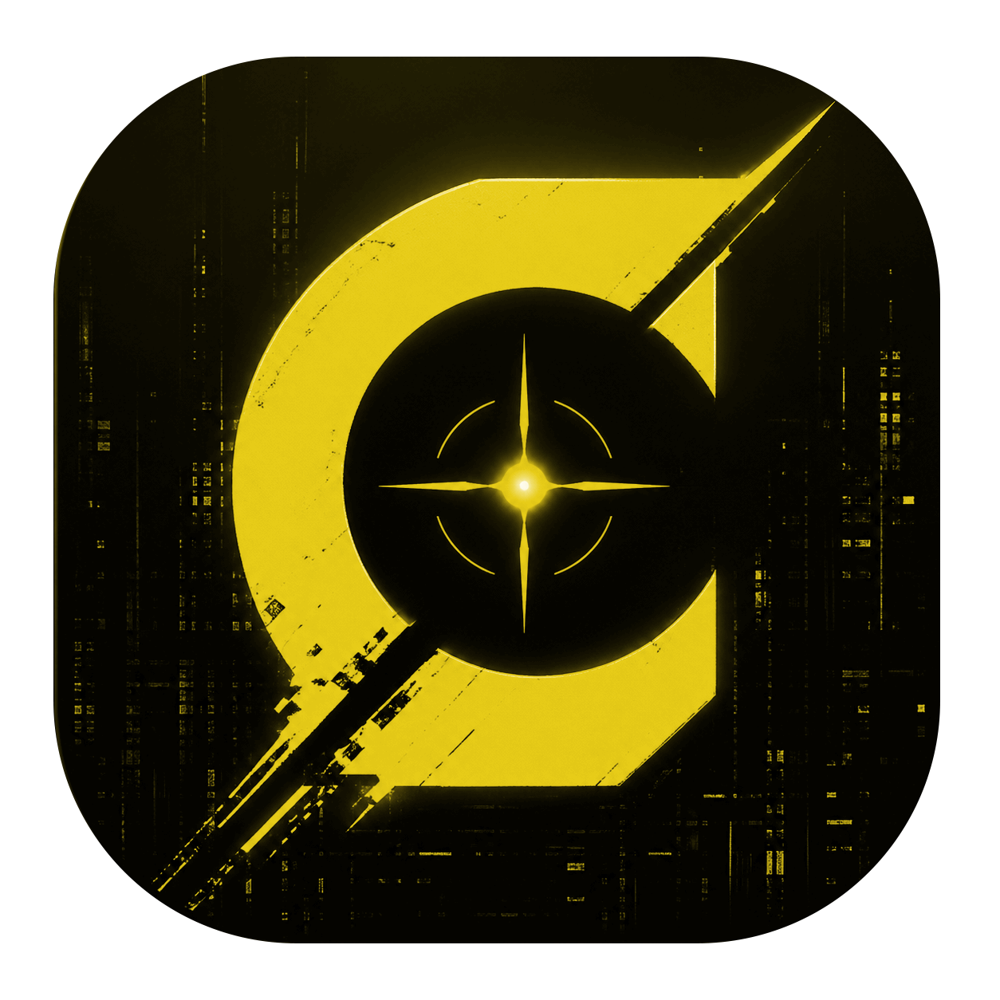
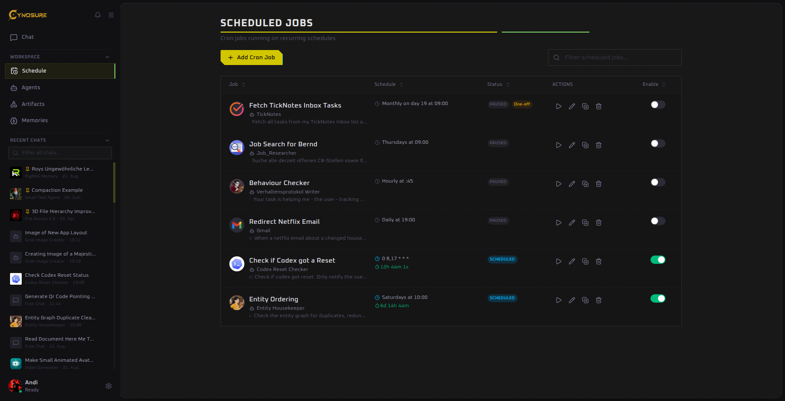

  

<h1 align="center">Cynosure</h1>

  A private desktop workspace for AI agents, connected tools, long-term memory, and automation.

  <a href="https://github.com/andreasjhagen/Cynosure/releases"><strong>Download Cynosure</strong></a>
  ·
  <a href="https://github.com/Cynosure-AI/docs">Documentation</a>

## Your AI workspace

Cynosure brings models, tools, documents, and recurring workflows together in one desktop application. Start with a simple conversation, create reusable agents for work you do often, and let those agents use only the capabilities and knowledge you choose.

You can connect hosted or local models, including OpenAI, Anthropic, Google Gemini, OpenRouter, Groq, Mistral, Grok, Ollama, and LM Studio. Model configuration, chats, agents, memory spaces, and schedules remain under your control.

## What Cynosure can do

### Communication

- Draft, answer, search, retrieve, and organize emails and messages.
- Identify unanswered requests, confirmations, follow-ups, and unfinished tasks.

### Web and research

- Research topics, websites, products, jobs, prices, and offers.
- Extract, compare, summarize, and save relevant information.
- Import todo items from TickNotes.

### Files and folders

- Analyze, clean up, rename, move, group, and organize local files.
- Find duplicates, outdated files, chaotic folder structures, and loose downloads.
- Sort media, documents, assets, notes, and project material into useful structures.
- Convert files between formats.

### Media and documents

- Extract text from screenshots, scans, PDFs, and images.
- Generate images and video clips with connected tools.

### Memory and knowledge

- Index chats, files, notes, and documents into searchable memory.
- Clean up, merge, connect, and summarize stored knowledge.

### Automation

- Control desktop apps, browsers, forms, files, and recurring workflows through connected tools.
- Complete multi-step tasks with previews, confirmations, and safety checks.

## Build reusable specialists

An agent packages a model, a system prompt, tools, memory, and optional sub-agents into a focused assistant. Create specialists for research, file organization, communication, coding, knowledge management, or any repeatable workflow.

## Give agents long-term knowledge

Organize source documents into memory spaces, retrieve the most relevant context during a conversation, and explore extracted entities and relationships in a visual graph.

## Automate recurring work

Schedule agents to run every few minutes, hourly, daily, weekly, monthly, or with a custom cron expression. Jobs can run research, monitor sources, process an inbox, prepare summaries, or maintain a workspace.

## Download

Installers and new versions are published on the [Cynosure Releases page](https://github.com/andreasjhagen/Cynosure/releases).

## About this repository

This repository contains only the end-user documentation website for Cynosure. It is built with VitePress; the desktop application and its release packages are maintained in the [main Cynosure repository](https://github.com/andreasjhagen/Cynosure).
