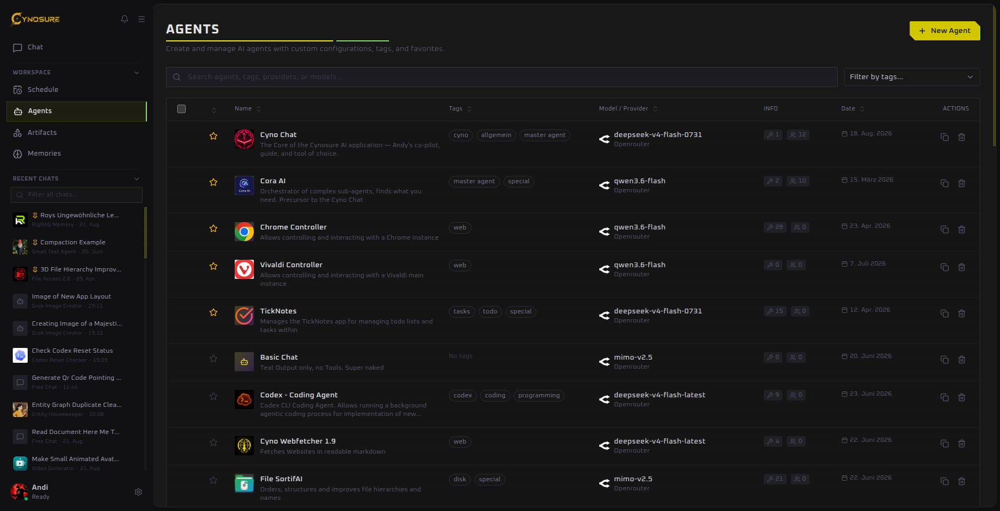

Reusable specialists

# Agents

An agent is a reusable chat configuration: an identity, a model, stable instructions, and optional tools, memory, sub-agents, and execution rules.

## Create an agent

1. Open **Agents** and select **New Agent**.
2. In **General**, add a clear name and a short description. Tags make a large library easier to filter.
3. Choose a **Provider / Model**. Leaving this at the provider default makes later model changes easier.
4. Write a **System Prompt** that defines the role, desired output, boundaries, and when to ask for clarification.
5. Configure the remaining tabs, then save.

## Agent sections

| Section | What to configure |
| --- | --- |
| **General** | Name, internal name, icon, description, tags, favorite state, model, and system prompt. |
| **Tools** | Explicit tools and automatic tool discovery. |
| **Memory** | Assigned memory folders, automatic retrieval, and an agent-owned memory space. |
| **Sub-Agents** | Other agents this agent may delegate to, with clear internal names and descriptions. |
| **Advanced** | Auto-approval, routing model, thinking mode, reasoning level, token limits, and context-window limits. |

## Write a useful system prompt

A good prompt answers four questions:

1. What role does this agent have?
2. What inputs and tools should it use?
3. What should its output look like?
4. Which actions require confirmation?

Keep durable behavior in the agent prompt and put job-specific instructions in chat. If a prompt contains changing details such as dates or filenames, it will become stale quickly.

## Use sub-agents well

Give each delegated agent a narrow purpose and a distinct description. The parent agent uses that description to decide whom to call. Avoid circular delegation and do not give several sub-agents indistinguishable roles.

## Duplicate or remove an agent

The actions at the right of the agent list let you duplicate an agent as a starting point or delete it. Favorites appear first and are easier to find in selectors.

::: warning Before deleting
Review schedules and messaging channels that use the agent. Export a backup if its configuration or conversations may be needed later.
:::
