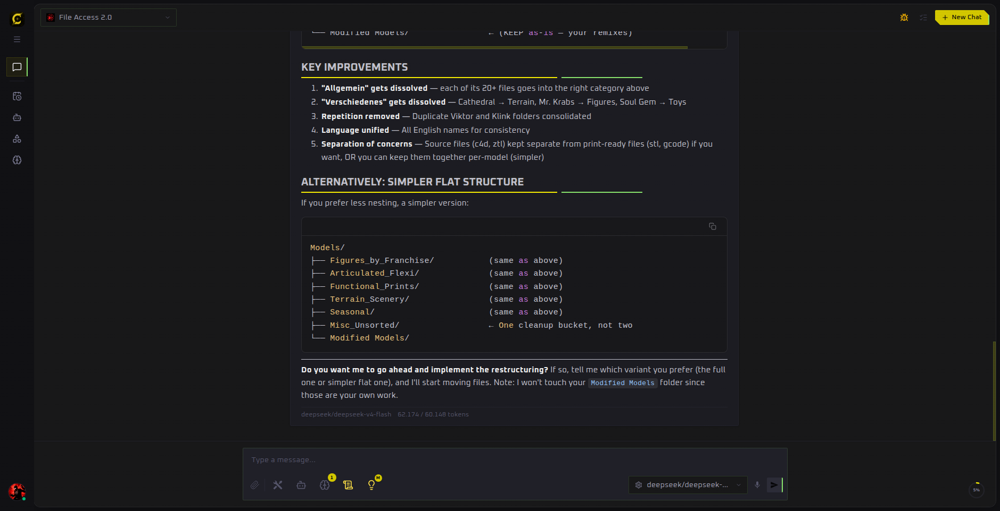

Core workflow

# Chat

Chat is where a model or agent turns your request into a response, a file, or a sequence of tool-assisted actions. A conversation keeps its own configuration, so you can adjust capabilities without changing an agent permanently.

## Choose how to chat

- **Free Chat** starts without an agent definition. Choose a provider and model directly and add capabilities for this conversation.
- **Agent Chat** loads the agent’s model, system prompt, tools, memory, sub-agents, and advanced settings.

Use **New Chat** when the topic changes significantly. This gives the model a clean context and makes past work easier to find.

## Composer controls

From left to right, the composer can include:

| Control | What it changes |
| --- | --- |
| Attachment | Adds an image, document, audio file, or other supported file. |
| Tools | Selects tools directly or enables automatic tool discovery. |
| Sub-agents | Makes selected agents available for delegation. |
| Memory | Selects memory folders and automatic retrieval. |
| System prompt | Adds conversation-specific instructions. |
| Thinking | Chooses the reasoning level when the selected model supports it. |
| Provider / model | Overrides the model for this conversation. |
| Microphone | Records speech and transcribes it into the composer. |

The context ring beside **Send** shows how much of the model’s context window the conversation is using.

## Work with files

Select the paperclip and choose a file. Small documents can be included directly in model context; larger documents can switch to retrieval according to **Settings → Chat → Attachment Context**. Generated files are linked in the response and collected under **Artifacts**.

## Review tool-assisted work

Tool calls appear inside the conversation. Expand them to inspect inputs, output, and failures. Some calls pause for approval before they run; see [Tools & approvals](/features/tools).

A saved agent can inspect a workspace and return a structured plan before making changes.

## Change a session safely

Changing the model, tools, memory, sub-agents, or prompt creates a session override. The configuration status control lets you:

- reset the conversation to the agent’s current defaults;
- save the changes back to that agent; or
- save the session configuration as a new agent.

This makes it easy to experiment without accidentally changing every future conversation.
