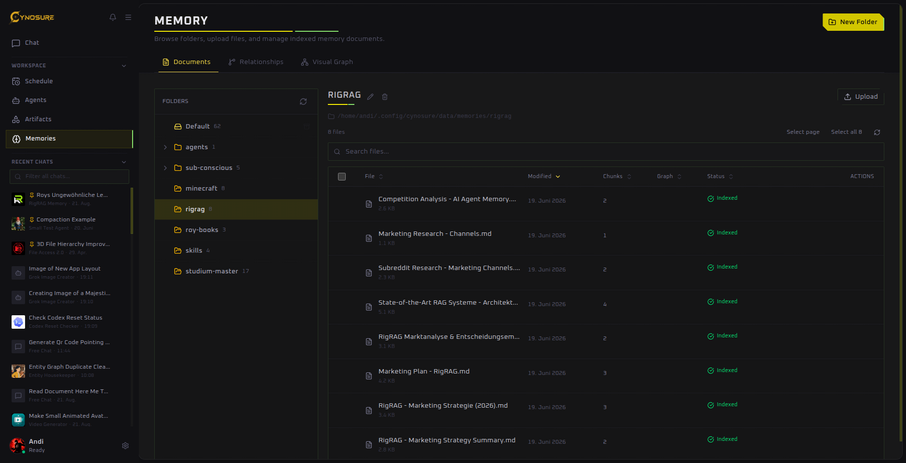
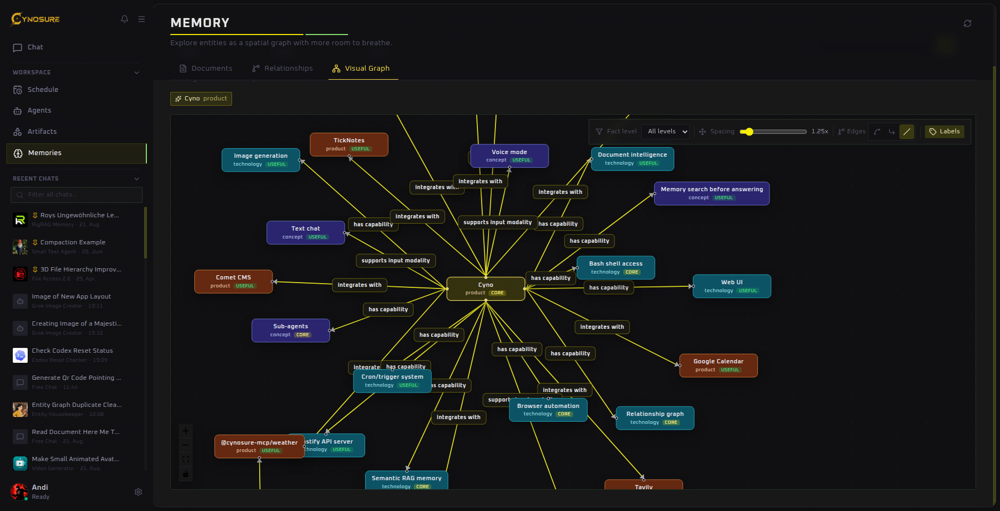

Long-term knowledge

# Memory

Memory spaces turn your documents into searchable context. Source documents remain authoritative. Cynosure derives rebuildable chunks, vectors, entity mentions, temporal assertions, and relationship views from versioned document revisions.

## Add documents

1. Open **Memories → Documents**.
2. Select **New Folder** to create a focused collection, or select an existing folder.
3. Select **Upload** and choose your files.
4. Wait until each file shows **Indexed** before relying on it in chat.

Focused folders generally retrieve better than a single catch-all collection. Group documents by project, client, subject, or access boundary.

## Use memory in chat

Select the memory control in the composer, choose one or more folders, and enable **Automatically retrieve relevant memory**. On an agent, make the same choice in its **Memory** tab to reuse it in every conversation.

Automatic retrieval searches for chunks relevant to the current request. It does not paste every document into every message.

For each turn, Cynosure keeps the original request unchanged and may add up to two same-language search expansions. Dense semantic and lexical BM25 chunk candidates receive independent quotas, are rank-fused, and can then be reranked. The knowledge projection independently searches entity aliases and descriptions, governed predicates, assertion text, and exact source quotes. Explicit relationship questions can use a bounded personalized graph walk; ordinary questions remain on the faster direct path.

Every selected assertion is hydrated back to the canonical source chunk before it reaches the agent. A verifier injects only evidence that directly supports the request; if the pool is merely related, it can issue one precise corrective search and otherwise returns no memory context.

Retrieval scores use different scales. Semantic similarity and reranker relevance may be displayed as percentages. Rank-fusion and BM25 values are ranking signals, not probabilities, and are labeled accordingly.

Extraction confidence, entity-resolution confidence, source trust, entailment, and retrieval relevance are also separate signals. Cynosure never presents their weighted combination as a semantic-match percentage.

## One memory plane, specialized projections

Cynosure uses one governed memory plane rather than one physical table:

- source files and their content hashes are the authority;
- canonical text units preserve chunk-level provenance;
- entity mentions—including durable entities with no relationship edge—preserve surface text, source spans, resolution decisions, and aliases;
- a predicate registry normalizes common relationship wording while flagging unmanaged predicates;
- assertions support entity or literal objects, validity intervals, active/superseded/disputed/retracted states, and multiple evidence observations;
- LanceDB stores rebuildable semantic projections for chunks, entities, and assertions;
- the visual graph is a read view over those same entities and assertions, not a second implementation or source of truth.

Extraction writes a staging run, validates exact quotes and the source revision, then activates the complete run atomically. The previous run stays searchable if extraction fails. Background indexing jobs persist across restarts, retry transient failures, and move exhausted jobs to a dead-letter state.

Ambiguous same-name people are deliberately kept separate unless a grounded identity hint, same-document evidence, or sufficiently specific canonical name supports merging. Duplicate entities reduce recall less severely than conflating two people and returning a confident false fact.

## Relationships and visual graph

The **Relationships** view lists extracted connections. **Visual Graph** lays entities out spatially so you can follow edges, filter fact levels, adjust spacing, and show or hide labels.

Select an entity to center the graph on a product, person, concept, or technology.

## Memory settings that matter

- **Embedding Model** controls how document chunks and queries become vectors. Changing it can require re-embedding.
- **Automatic Memory Retrieval** controls the number of ranked results returned per query.
- **Retrieval Reranker** can improve ordering of candidates.
- **Chunking** sets chunk size and overlap.
- **OCR** extracts visible text from images embedded in supported documents.
- **Entity Extraction Model** creates grounded entity mentions and assertions during explicit knowledge indexing. The Relationships and Visual Graph screens read those records directly.

::: warning Changing embeddings
Do not switch embedding model or dimensions casually. Existing vectors may need to be rebuilt before search results become reliable again.
:::

## Improve weak retrieval

Use descriptive filenames, remove outdated duplicates, place documents in a narrowly scoped folder, and ask a specific question. If results remain poor, review chunk size and retrieval count before changing the embedding model.

For repeatable quality checks, maintain a JSON evaluation set with positive and unanswerable queries and run `pnpm --filter cynosure-server memory:evaluate <dataset.json>`. Cases can select `chunks`, `knowledge`, or full `aggregate` retrieval and can declare relevant source files, expected `{ from, predicate, to }` relationships, or both. The report includes Hit/Recall/Precision/nDCG at K, mean reciprocal rank, no-answer false-positive rate, and latency. An object-form dataset can include thresholds so regressions fail the command in CI.

To rebuild a folder, call `POST /api/memory-spaces/:id/knowledge/rebuild`. Each current indexed document is queued independently. Inspect durable jobs with `GET /api/memory-spaces/jobs`, knowledge health with `GET /api/memory/knowledge/stats`, and grounded diagnostic results with `POST /api/memory/knowledge/search`.

**Reset Data → Entity Graph** clears the complete derived knowledge projection, its semantic graph index, and entity-index jobs while preserving source files and ordinary chunk vectors. Documents are marked as needing entity extraction and can be rebuilt from their source afterward.
