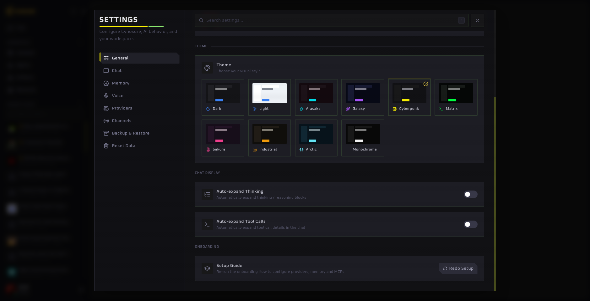

Personalize & configure

# Settings

Open Settings from the gear beside your profile. Use the search field to jump directly to a setting by name or related term.

## General

Set your profile name and image, choose a theme, decide whether thinking and tool-call blocks expand automatically, and re-run the setup guide. Cynosure includes Dark, Light, Arasaka, Galaxy, Cyberpunk, Matrix, Sakura, Industrial, Arctic, and Monochrome themes.

## Chat

Configure the context-routing model, AI-generated chat titles, context strategy, attachment handling, and the context inspector. Context strategy determines how Cynosure handles a conversation that outgrows the selected model’s window.

## Memory

Choose embedding and knowledge-extraction models, retrieval count, reranking, chunking, and vector storage behavior. See [Memory](/features/memory) before changing an established index.

## Voice

Enable the microphone button and choose local Whisper or a remote transcription model. Local Whisper offers model size, quantization, language, input-device, and download-cache controls. Larger models are generally more accurate but need more download space and compute.

## Providers

Add, edit, test, or remove model providers. Each provider can have a display name, base URL, API key, and default model. Test the connection after changing credentials or endpoints.

Supported provider types include OpenAI, Anthropic, Google Gemini, OpenRouter, Requesty, Groq, Mistral, Grok, Ollama, and LM Studio.

## Channels

Connect Telegram, Discord, and Slack, assign allowed agents, test the connection, and enable or disable remote access.

## Backup & Restore

Export selected workspace modules or restore them from an earlier Cynosure backup. See [Backup & restore](/guide/backup).

## Reset Data

Clear selected areas such as conversations, notifications, usage, memory, vectors, the knowledge graph, agents, providers, MCP servers, settings, or channels.

::: danger Reset is destructive
Export a backup first. Resetting vector indexes differs from deleting memory source documents; read the description of every selected module before confirming.
:::
