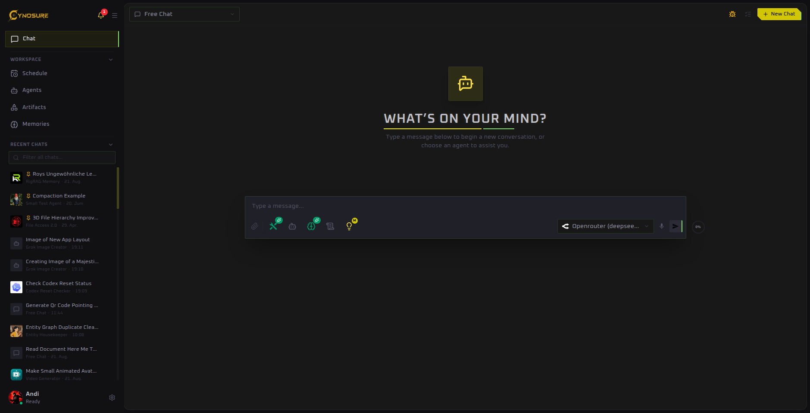

Desktop AI workspace

## From a question to completed work

Cynosure brings chat, reusable agents, connected tools, long-term knowledge, and automation into one desktop application. Start with a plain conversation; add capabilities only when the job needs them.

The main workspace keeps conversations, agents, schedules, artifacts, and memory close at hand.

  <a class="quick-card" href="./guide/getting-started"><strong>New to Cynosure?</strong>Connect a model provider and send your first message.</a>
  <a class="quick-card" href="./guide/examples"><strong>See what it can do</strong>Explore practical examples for communication, research, files, media, memory, and automation.</a>
  <a class="quick-card" href="./features/agents"><strong>Build a specialist</strong>Create an agent with a stable role, toolset, and knowledge.</a>
  <a class="quick-card" href="./features/memory"><strong>Add your knowledge</strong>Upload documents and make their contents available to agents.</a>

